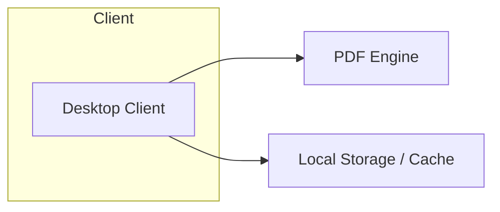

# Project Edoba: Gymnast Design Document

## Contributors
HisDewness
Gallowan
mkhuluf

## **1. Overview & Vision**

Gymnast is the first product in the Project Edoba product suite to counter subscription-based services of the Adobe suite—offering high-performance opening, rendering, and navigation of PDF files across Windows and macOS, with Linux support planned (tbd).

### **1.1 Mission**

To provide users with a fast, reliable, and open-source PDF viewer and renderer as part of the Project Edoba suite.

### **1.2 Goals**

- **MVP**: Reliable, high-performance opening and rendering of PDF files.
- **Modular Roadmap**: Sequential delivery of editing, form-handling, signing, and plugin support.
- **Community**: Clear contribution guidelines, transparent roadmap, issue triage.

---

## **2. Target Users & Personas**

| **Persona**          | **Needs**                     | **Pain Points**               |
|----------------------|-------------------------------|-------------------------------|
| Freelance Designer   | Quick proof review; bookmarks | Heavy commercial tools; costs |
| Business Analyst     | Fast form checks; data copy   | Slow load times; no free option |
| Open-Source Advocate | Extend engine; integrate CLI  | Closed-source limitations     |

---

## **3. Core Features & Timeline**

### **3.1 MVP (v1.0 — Q4 2025)**

- **Open & Render**: Load standard PDFs (text, images) with thumbnails, bookmarks, and page navigation.
- **Performance**: Cold-start open ≤ 2 s for a 10-page document; page render ≤ 100 ms.

### **3.2 Post-MVP Roadmap**

| **Version** | **Feature**                               |
|-------------|-------------------------------------------|
| **v1.1**    | Merge/split pages; rotate/reorder         |
| **v1.2**    | Form filling (AcroForms); export to PDF/A |
| **v1.3**    | Digital signatures (verify & apply PAdES) |
| **v1.4**    | Plugin architecture & marketplace         |
| **v1.5**    | Linux client support                      |

---

## **4. System Architecture**

- **Desktop Client**: Electron (TypeScript) or Tauri (Rust + Web UI)
- **PDF Engine**: Poppler (C++) or PDFium, via native bindings
- **Local Layer**: SQLite metadata; file system for PDFs

---

## **5. Technology Stack**

| **Layer**           | **Option A**      | **Option B**         |
|---------------------|-------------------|----------------------|
| Desktop Framework   | Electron (TS)     | Tauri (Rust + Web)   |
| PDF Rendering       | Poppler binding   | PDFium binding       |
| Metadata Storage    | SQLite            | Flat JSON files      |

---

## **6. UI / UX**

- **Home Screen**: Recent files list; drag-and-drop; quick open.
- **Document View**: Toolbar with zoom, search, and page controls.
- **Navigation**: Thumbnails sidebar; bookmark panel.

---

## **7. Security & Privacy**

- **Local Data**: AES-256 encrypted cache (opt-in).
- **Open-Source Audit**: Public code review; no telemetry by default.

---

## **8. Open-Source Strategy**

- **Repo Structure**: `/client`, `/engine-bindings`, `/docs`, `/plugins`
- **License**: MIT or Apache 2.0
- **Contribution**: `CONTRIBUTING.md`, templates, Code of Conduct

---

## **9. OS-Specific Considerations**

### **Windows**

- **Installer**: Provide MSI/EXE with customizable options; integrate with Windows Installer service.
- **Dependencies**: Bundle Microsoft Visual C++ Redistributables.
- **Rendering**: Optimize for Windows graphics subsystem; test Direct2D GPU acceleration.
- **Integration**: Register `.pdf` extension; support drag-and-drop from File Explorer; shell thumbnails.
- **Accessibility & UI**: Leverage Windows UI Automation; support high DPI and system themes.
- **Code Signing**: Use Authenticode certificates for SmartScreen trust.
- **Updates**: Employ auto-updater (e.g., Squirrel.Windows) or Task Scheduler hooks.

### **macOS**

- **Installer**: Package as signed `.dmg` or `.pkg`; support auto-updates via Sparkle framework.
- **Code Signing & Notarization**: Comply with Apple Developer ID requirements and notarize builds.
- **Bundle Structure**: Standard `.app` with Info.plist; adhere to sandboxing if required for App Store.
- **Integration**: Register UTI for PDF; support Quick Look generator plugin; Spotlight indexing.
- **Accessibility**: Implement NSAccessibility protocols; ensure VoiceOver support and Retina-ready UI.
- **Rendering**: Optionally leverage native PDFKit for performance testing and fallback.
- **Notifications**: Use Notification Center for update and error alerts.

---

## **10. Metrics & Success Criteria**

### **10.1 Adoption**

- **Downloads**: 10,000 installs in first 6 months.

### **10.2 Performance Benchmarks (v1.0 vs. Adobe Acrobat DC)**

| **Metric**                    | **Target**    | **Adobe Acrobat DC Reference** |
|-------------------------------|---------------|--------------------------------|
| Cold-start load (10 pages)    | ≤ 2 s         | ~ 5 s (commercial average)     |
| Page render latency           | ≤ 100 ms      | ~ 200 ms                       |
| Idle memory footprint         | ≤ 150 MB      | ~ 300 MB+                      |
| Continuous scroll throughput  | ≥ 50 pp/s     | ~ 25 pp/s                      |
| Cold launch startup time      | ≤ 3 s         | ~ 5 s                          |

### **10.3 Reliability**

- No crashes on sample 50-page docs over 24 h of continuous use.

---

## **11. Appendices**

- **A. Glossary**
- **B. Wireframes & Mockups**
- **C. Plugin API Spec (OpenAPI YAML)**
